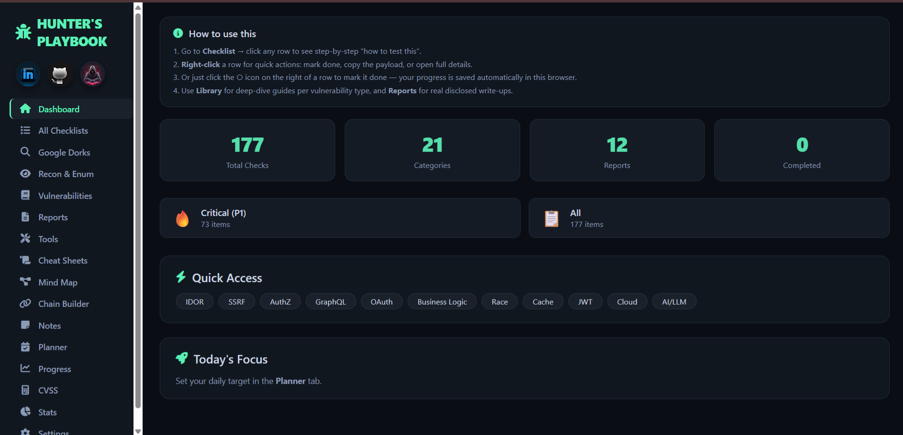

<div align="center">

# 🐛 Hunter's Playbook

### The Ultimate Bug Bounty & Penetration Testing Workspace

A modern all-in-one workspace built for Bug Bounty Hunters, Pentesters, Security Researchers and Cybersecurity Enthusiasts.

<p align="center">
  <a href="https://iamstudent-000.github.io/hunters-playbook/">
    
  </a>
  
  
  
</p>

</div>

---

## 📸 Dashboard Preview

<p align="center">
  
</p>

---

## 🌐 Live Website

### 🚀 Launch Hunter's Playbook

**Website:**  
https://iamstudent-000.github.io/hunters-playbook/

---

# 🎯 About The Project

Hunter's Playbook is a professional cybersecurity workspace designed to help security researchers organize their complete hunting workflow from reconnaissance to reporting.

Instead of using multiple applications for notes, checklists, dorks, reports, attack chains and progress tracking, Hunter's Playbook brings everything together inside a single clean and efficient interface.

The goal is simple:

> Spend less time organizing and more time hunting.

Whether you're a beginner learning web security or an experienced bug bounty hunter managing multiple targets, Hunter's Playbook helps maintain a structured and repeatable testing process.

---

# ✨ Features

## 📊 Interactive Dashboard

Monitor your complete hunting activity through a centralized dashboard.

- Total Checks Overview
- Categories Overview
- Reports Overview
- Progress Tracking
- Quick Navigation
- Daily Focus Section

---

## ✅ Vulnerability Checklist

A structured vulnerability testing checklist designed to improve testing coverage.

### Categories Include:

- IDOR
- SSRF
- Authentication Issues
- Authorization Issues
- GraphQL
- OAuth
- Business Logic
- Race Conditions
- Cache Poisoning
- JWT
- Cloud Security
- AI / LLM Security
- And many more...

Features:

- Progress Tracking
- Testing Guidance
- Quick Actions
- Organized Categories
- Priority Based Testing

---

## 🔍 Recon & Enumeration Workspace

Keep reconnaissance activities organized.

Store and manage:

- Targets
- Assets
- Subdomains
- Endpoints
- Interesting Findings
- Enumeration Notes

---

## 🌐 Google Dorks Library

A collection of useful reconnaissance and asset discovery dorks.

Perfect for:

- Information Gathering
- Surface Discovery
- Public Exposure Detection
- Search-Based Reconnaissance

---

## 🐞 Vulnerability Management

Track discovered vulnerabilities efficiently.

Store:

- Vulnerability Details
- Severity
- Impact
- Reproduction Steps
- Notes
- References

---

## 📄 Reports Workspace

Maintain professional disclosure notes and reports.

Useful for:

- Bug Bounty Reports
- Pentest Findings
- Responsible Disclosure
- Research Documentation

---

## ⚒️ Security Tools Hub

Quick access to commonly used resources and tools.

Designed to reduce context switching during assessments.

---

## 📚 Cheat Sheets

A dedicated knowledge base containing:

- Commands
- Payloads
- Methodologies
- Security References
- Testing Techniques

---

## 🧠 Mind Map

Visualize testing processes and attack paths.

Helps researchers understand:

- Attack Flow
- Testing Methodology
- Vulnerability Relationships

---

## 🔗 Attack Chain Builder

Build complete attack chains by connecting multiple findings together.

Perfect for:

- Chained Exploitation
- Business Logic Attacks
- Multi-Step Scenarios
- Impact Demonstration

---

## 📝 Notes Workspace

Store:

- Payloads
- Interesting URLs
- Research Notes
- Testing Ideas
- Important Observations

Everything stays organized and accessible.

---

## 📅 Planner

Plan your hunting sessions effectively.

Features:

- Daily Goals
- Research Tasks
- Target Planning
- Productivity Management

---

## 📈 Progress Tracker

Track overall testing progress.

Benefits:

- Improved Coverage
- Better Consistency
- Clear Visibility
- Performance Monitoring

---

## 🎯 CVSS Calculator

Quickly calculate vulnerability severity scores.

Useful for:

- Reporting
- Risk Assessment
- Prioritization
- Professional Documentation

---

## 📊 Statistics Dashboard

Analyze your hunting workflow with useful metrics and statistics.

---

# 🔒 Privacy First

Hunter's Playbook runs entirely in your browser.

✅ No Login Required

✅ No Backend Required

✅ No External Database

✅ No User Tracking

✅ No Cloud Dependency

✅ Local Storage Based

Your data remains under your control.

---

# 👨‍💻 Built For

- Bug Bounty Hunters
- Ethical Hackers
- Security Researchers
- Penetration Testers
- Cybersecurity Students
- Red Team Learners
- Web Security Enthusiasts

---

# 💻 Technology Stack

| Technology | Purpose |
|------------|----------|
| HTML5 | Structure |
| CSS3 | Styling |
| JavaScript | Functionality |
| Local Storage | Data Persistence |
| Font Awesome | UI Icons |

---

# 🚀 Getting Started

Clone the repository:

```bash
git clone https://github.com/iamstudent-000/hunters-playbook.git
```

Open:

```text
index.html
```

That's it.

No installation required.

No dependencies required.

No server required.

---

# 🔮 Future Improvements

- Advanced Search System
- Export / Import Workspace
- PDF Report Generator
- Markdown Report Export
- Custom Templates
- Additional Vulnerability Categories
- Advanced Analytics
- Multi-Theme Support
- Team Collaboration Features

---

# ⚠️ Disclaimer

This project is intended strictly for:

- Ethical Hacking
- Security Research
- Bug Bounty Programs
- Authorized Penetration Testing
- Cybersecurity Education

Users are solely responsible for ensuring that all testing activities are conducted with proper authorization and in compliance with applicable laws and program policies.

---

<div align="center">

## ⭐ If You Like This Project, Consider Giving It A Star

### Built for the Cybersecurity Community 🛡️

**Hunter's Playbook — Organize. Hunt. Report. Repeat.**

</div>
